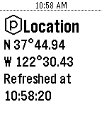
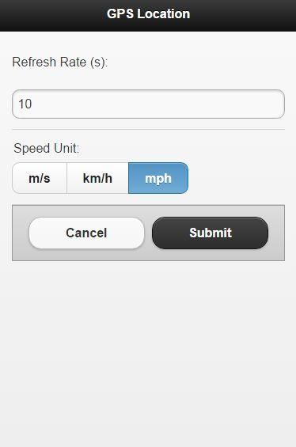

## Pebble Location app
This is a simple - working - demo of
 - The location package
 - The settings package
 - Shake to reset

The app gives the location of the device in latitude and longitude, plus  the speed and heading.

A configuration screen helps you to set the speed unit, and the refresh rate.

   

------------------------------------------------------
