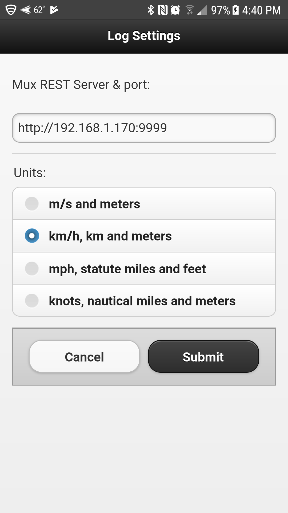
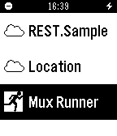
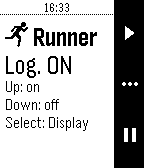
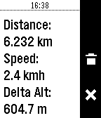
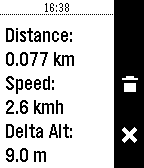

## Mux Runner

This project goes along with [this project](https://github.com/OlivierLD/raspberry-pi4j-samples/tree/master/NMEA.multiplexer). It is a `pebble` client for a REST server.

#### Configure
Provide the IP address of the Raspberry PI doing the logging, and the units you want to use.
> Warning: This config is to be done _before_ you connect to the Raspberry PI network, the configuration page requires Internet access.

#### Run it!
Choose the item in the App menu on the watch. Make sure your phone is connected to the Raspberry PI network.

The screen gives you the status of the logger.

Use the `up` and `down` buttons to turn it on or off.

Use the `select` button to display the current data.

The display is refreshed every one second. Use the `down` button to stop this.

Use the `select` button to reset the values.

After reset, distance and delta-altitude have been set to zero.

---
