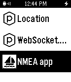
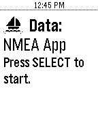
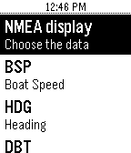
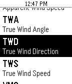
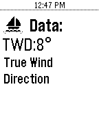

## Pebble NMEA app
Application list
 

 
Press select to start
 

 
Srcoll...
 

 
Choose...
 

 
Displayed!
 

This app is a WebSocket client for the application described [here](http://www.lediouris.net/RaspberryPI/_Articles/readme.html).

All the data you want on your wrist, for less that $100!