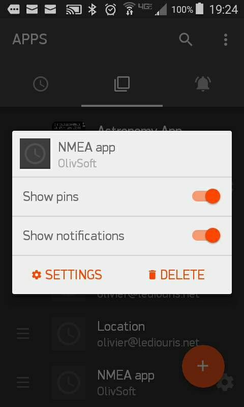

## Pebble NMEA app

Copy the content of `app.js` in your [CloudPebble](https://cloudpebble.net/ide/) account.

The config page `NMEA.app.html` is already deployed.
You can modify this page, and deploy it to your own server. Just make sure its url is mentioned 
in the `url` member of the parameter sent to the `Settings.config` function in `app.js`.

Configuring the app requires Internet access, make sure you configure it when you have some.
Typically here, this app is designed to be used on board, when Internet access can be questionable.
Make sure the watch is configured appropriately before you leave the dock. 

In the `RESOURCES` section, add the `small.boat.png` file, name it `paperboat.png`, as mentionned in the code.

Then in the `COMPILATION` section, start a build, followed by `INSTALL AND RUN`.

You should be good to go!

<table>
  <tr>
    <td>
      Application list
       
      
    </td>
    <td>
      Press select to start
       
      
    </td>
    <td>
      Srcoll...
       
      
    </td>
  </tr>
  <tr>
    <td>
      Choose...
       
      
    </td>
    <td>
      Displayed!
       
      
    </td>
  </tr>
</table>

<table>
  <tr>
    <td>
      Configure...
       
      
    </td>
    <td>
      Set your WebSocket URI
       
      
    </td>
  </tr>
</table>
This app is a WebSocket client for the application described [here](http://www.lediouris.net/RaspberryPI/_Articles/readme.html).

All the data you want on your wrist, for less that $100!