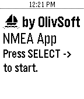
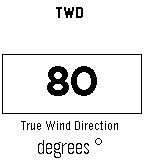

## Pebble NMEA app
<table>
  <tr>
    <td>
      Application list
       
      
    </td>
Press select to start
 

    <td>
Srcoll...
 

    </td>
    <td>
Choose...
 

    </td>
    <td>
Displayed!
 

    </td>
  </tr>
</table>

This app is a WebSocket client for the application described [here](http://www.lediouris.net/RaspberryPI/_Articles/readme.html).

All the data you want on your wrist, for less that $100!