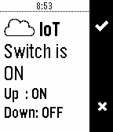

## Pebble REST client, used to reach an IoT server

Sample REST client application featuring
- Action Bar
- REST client interface

Reaches the Internet of Things server at io.adafruit.com. You need an `Adafruit-IO` account, its key will be
required to access the data.

