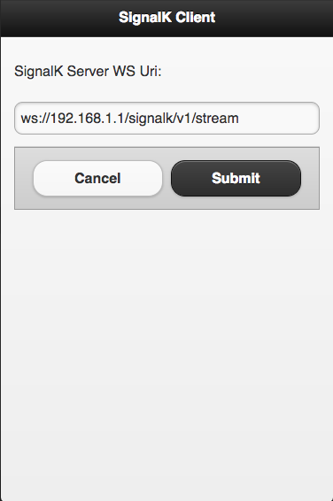
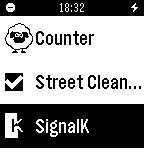
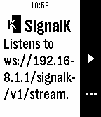
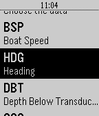

## Pebble WebSocket client for SignalK

Start the SignalK server
```bash
 $> bin/nmea-from-tcp
```
This also starts a WebSocket server, its URL is `ws://localhost:3000/signalk/v1/stream`.

You can see this URL from any REST client (PostMan, your browser), by issuing to the SignalK server a request like
```
 GET /signalk
```


See above the member that says `signalk-ws `. It gives you the port and the path.

The Pebble app uses this connection to read the data produced by SignalK.

The connection above is to be set in the Settings.



<table>
  <tr>
    <td style="border: 1px solid #CCC; border-radius: 5px; padding: 3px; background-color: LightGray; text-align: center;">
      Application list
      <br/>
      
    </td>
    <td style="border: 1px solid #CCC; border-radius: 5px; padding: 3px; background-color: LightGray; text-align: center;">
      Start here
      <br/>
      
    </td>
    <td style="border: 1px solid #CCC; border-radius: 5px; padding: 3px; background-color: LightGray; text-align: center;">
      Data picker
      <br/>
      
    </td>
    <td style="border: 1px solid #CCC; border-radius: 5px; padding: 3px; background-color: LightGray; text-align: center;">
      Displayed
      <br/>
      
    </td>
  </tr>
</table>


---
